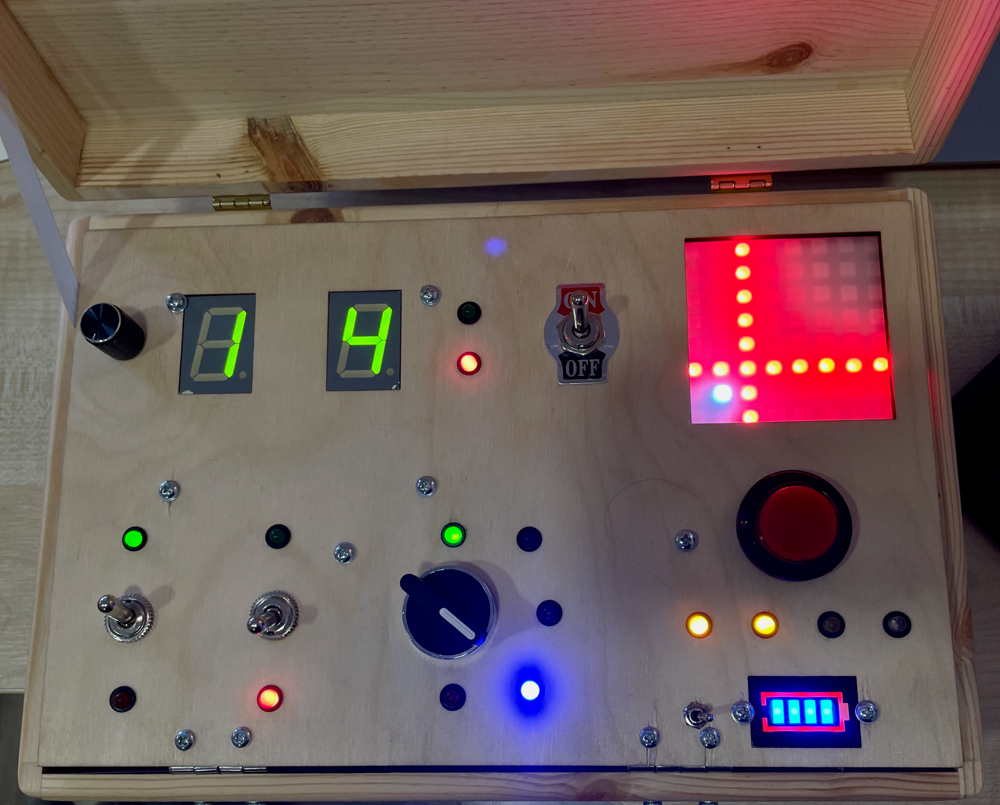

# NuclearBriefcase
Control panel with switches and screens, move all switches to green status to launch an explosion

## Parts
* Pico 2 MCU
* MCP23017 I/O Expander
* Piezo buzzer
* 7 segment displays (common anode)
* SK6812 8x8 RGB LED Matrix
* etc
